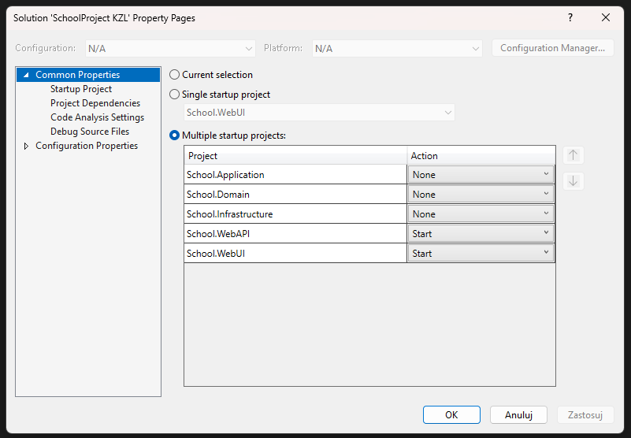

# SchoolProject-KZL - Spis treści
1. [Introduction](#introduction)
2. [Requires](#introduction)
3. [How to run the program](#how-to-run-the-program)

# Introduction
SchoolProject is ASP.NET Core application created to learn the framework. It is built in client-server architecture.It allows you to manage the school classroom . The technologies I used are ASP.NET Core, Blazor & EF.
## Requires

- .NET Core framework
- Visual Studio or VS Code
- SQL Server Database (or Azure SQL)
# How to run the program
1. You should have .NET 7.0 installed.
2. Open `SchoolProject KZL\School.WebAPI` and replace the connection string with connection string to your databse.
3. In Visual Studio:
	- Open the solution in Visual Studio
	- Open "Package manager console" and select the project "School.WebAPI"
	- Enter the command "Update-Database"

4. Expand start and select "Configure Startup Projects"

Set "Start" for School.WebApi & School.WebUI

